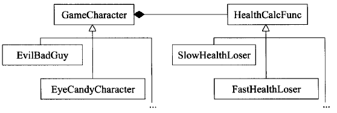

## Accustoming Yourself to C++

### View C++ as a federation of language

_c with class $->$ multiparadigm programming language_

_sublanguage_：

_C： blocks，statements，preprocessor，build-in data types，arrays，pointers_

​       _but no templates，no exceptions，no overloading..._

_Object-Oriented C++： classes，encapsulation，inheritance，polymorphism，virtual function_

_Template C++：generic programming part，template metaprogramming（TMP）_

_STL： containers，iterators，algorithms，function objects_


对于_C-like_类型_pass-by-value_通常比_pass-by-reference_高效

转向_Object-Oriented C++_时，由于用户自定义的构造，析构函数存在，_pass-by-reference-to-const_往往更好

_Template C++_更甚，但到了STL，由于其迭代器和函数对象都是在c指针上塑造的，_pass-by-value_守则再次适用


### Prefer consts，enums，and inlines to #defines

```#define```的名称也许从未被编译器看见，也许在编译器开始处理源码之前就被预处理器移走了，故可能没进入_symbol table_中

可以一个```const```常量替换```#define```，保证编译器能看到，进入_symbol table_内，同时可能导致较小量的码

两种特殊情况：

1.定义常量指针

```c++
const char* const authorName = "LK"
const std::string authorName = "LK"
```

2._class_专属常量

为了将其作用域限制在_class_内，确保至多有一份实体，声明为static成员。

```c++
static const int Num = 5;
```

通常C++要求对任何使用的东西提供定义，但如果为```static```的_class_专属常量且为整数类型，需特殊处理。只要不取地址，可只声明并使用。如果取地址或编译器坚持要看定义式需提供定义式

```c++
const int Classname::Num;
```

该式子放在实现文件中，已设过初值不可以再设

编译器支持或变量类型不允许“_in-class_初值设定”，可换如下表述

```c++
static const double Num ;//声明头文件中
const double Classname::Num = 5.0;//定义实现文件中
```

当_class_编译期间需要一个_class_常量值时，如数组大小。可用”_the enum hack_“补偿做法（“一个_enumerated type_的水可权充_ints_被使用”）

```c++
enum{ Num = 5; };
int Array[Num];
```

_enum hack_某方面行为像```#define```，取地址不合法，不会导致非必要的内存分配

_enum hack_实用，事实上为模板元编程的基础技术


```#define```宏看起来像函数，但不会招致函数调用开销，所有宏实参加上小括号，但总有预料之外的错误

_template inline_可解决此类问题


- 对于单纯常量，最好以```const```对象或```enums```替换```#defines```

- 对于形似函数的宏，最好改用```inline```函数替换```#defines```


### Use const whenever possible

```const```基本作用

被指物为常量两种写法：

```c++
const Classname* pc
Classname const* pc
```

STL迭代器作用像```T*```，声明迭代器为```const```就像声明一个```T* const```指针

函数声明时的作用，返回常量值...


```const```成员函数，确认改成员函数可作用于```const```对象

1.使_class_接口比较容易理解

2.使“操作```const```对象”成为可能

两个成员函数如果只是常量性不同可以被重载

真实程序中```const```对象大多用_passed by pointer-to-const_或_passed by reference-to-const_

函数的返回类型是个内置类型，那么改动函数返回值不合法


_bitwise constness_认为成员间数只有在不更改对象的任何成员变量（```static```除外）时可以说是```const```的。```const```成员函数不可以更改对象内任何non-static成员变量

一个更改了指针所指物的成员函数虽不能算```const```的，如果只有指针隶属对象，称次函数为_bitwise constness_不会引发编译器异议


_logic constness_认为一个```const```成员函数可以修改它所处理的对象内的某些_bits_，但只有在客户端测不出的情况下如此

如果编译器不允许，可用```mutable```释放掉_non-static_成员变量的_bitwise constness_约束

```const```和```non-const```成员函数中避免重复:常量性转除（_casting away constness_）

```non-const```调用其```const```兄弟

```c++
const char& operate[](std::size_t position) const
{
    ...
    return text[position];
}
char& operate[](std::size_t position)
{
    return const_cast<char&>(                   //返回值移除const
        static_cast<const Classname&>(*this)    //*this转为const
        [position]
    );
}
```

反之调用不可


- 将某些东西声明为```const```可帮助编译器侦测出错误用法，```const```可被施加于仍和作用域内的对象、函数参数、函数返回值、成员函数本体
- 编译器强实施_bitwise constness_，但编写程序时应该使用_conceptual constness_
- 当```const```和```non-const```成员函数有着实质等价的实现时，令```non-const```版本调用```const```版本可避免代码重复


### Make sure that objects are initialized before they're used

对于无任何成员的内置类型，手动初始化

内置类型以外的东西，构造函数，注意区分_assignment_和_initialization_，对象的成员函数初始化动作发生在进入构造函数本体之前，使用成员初始化列表


赋值操作首先调用```default```构造函数设初值而后赋值

初始化列表中的设置的实参被用作各个成员变量构造函数的实参

明确需要初值类型，重复时可合理遗漏，用赋值操作


成员初始化次序：_base classes_早于_derived classes_，_class_成员变量以声明次序初始化

不同编译单元内定义的_non-local static_对象的初始化次序无明确定义

将每个_non-local static_对象搬到自己的专属函数中（在此函数中被声明为```static```），这些函数返回一个_reference_指向它所含的对象。用户调用函数，而不是直接用对象。这样做因为C++保证函数内的local ```static```对象会在函数调用期间首次遇到定义式时被初始化。

```c++
class FileSystem{
public:
    ...
    std::size_t nameDisks() const;
    ...
};
extern FileSystem tfs;
-----------------------
class Directory{
public:
    Directory( params );
    ...
};
Directory::Directory( params )
{
    ...
    std::size_t disks = tfs.nameDisks();
    ...
}

Directory temDir( params );
```

不能确定初始化顺序。

```c++
class FileSystem{ ... };
FileSystem& tfs()
{
    static FileSystem fs;
    return fs;
}
class Directory{ ... };
Directory::Directory( params )
{
    ...
    std::size_t disks = tfs().nameDisks();
    ...
}
Directory& tempDir()
{
    static Directory td;
    return td;
}
```

```inline```效果佳，多线程不确定性。

任何一种```non-static```对象在多线程环境下“等待某事发生”都会有麻烦。处理方法：在程序的单线程启动阶段手工调用所有的_reference-returning_函数


- 内置类型对象手工初始化，因C++不保证初始化它们
- 构造函数最好使用成员初值列表，而不要在构造函数本体内使用赋值操作。初值列表顺序和声明次序保持一致
- 为免除“跨编译单元的初始化次序”问题，以_local static_对象替换_non-local static_


## Constructors,Destructors,and Assignment Operators

### Know what functions C++ silently write and calls

_empty class_被C++处理后，会生成编译器版本的声明，一个_copy_构造函数，一个_copy assignment_操作符和一个析构函数，一个```default```构造函数。这些函数都是```public```且```inline```的

```c++
class Empty{ };
-------相当于如下代码------被调用时才会被编译器创建
class Empty{
public：
    Empty(){...}
    Empty(const Empty& rhs){...}
    ~Empty(){...}
    
    Empty& operator=(const Empty& rhs){...}
}; 
```

编译器产出的析构函数_non-virtual_的除非_class_的_base class_声明有_virtual_析构函数

编译器只有当代码合法且有适当的机会证明它有意义才会生成_copy assignment_操作符


### Explicitly disallow the use of compiler-generated functions you do not want

_copy_构造函数和_copy assignment_操作符声明为_private_但不定义，可以继承阻止_copying_动作的_base class_


### Declare destruction virtual in polymorphic base class

当_derived class_对象经由一个_base class_指针被删除，而该_base class_带着一个_non-virtual_析构函数，其结果未定义，通常是对象的_derived_成分没被销毁。消除该问题方法：给_base class_一个_virtual_析构函数

当_class_不企图被当做_base class_，令其析构函数为_virtual_不可取。带有_virtual_函数的_class_都有一个相应的_vptr（virtual table pointer）_，对象占用大小增加。一般来说只有当_class_内含至少一个_virtual_函数才为它声明_virtual_析构函数

为希望成为抽象的_class_声明一个_pure virtual_析构函数，必须为此析构函数提供一份定义

这种规则只适用于_polymorphic base class_，目的是通过_base class_接口处理_derived class_对象


### Prevent exceptions from leaving destructors

```c++
//如果close抛出异常就结束程序，通常通过调用abort完成
DBConn::~DBConn()
{
    try{ db.close(); }
    catch(...){
         制作运转记录，记下对close的调用失败;
        std::abort;
    }
}
```

阻止异常从析构函数传播出去

```c++
//吞下因调用close而发生的异常
DBConn::~DBConn()
{
    try{ db.close(); }
    catch(...){
         制作运转记录，记下对close的调用失败;
    }
}
```


```c++
//重新设计接口
class DBConn{
public:
    ...
    void close()
    {
        db.close;
        close = true;
    }
    ~DBCoon()
    {
        if(!closed){
            try{
                db.close();
            }
            catch(...){
                制作运转记录，记下对close的调用失败;
                ...
            }
        }
    }
private:
    DBconnection db;
    bool closed;
};
```


- 析构函数绝对不要吐出异常，如果一个被析构函数调用的函数可能抛出异常，析构函数应该捕捉任何异常，然后吞下它们（不传播）或结束程序
- 如果客户需要对某个操作函数运行期间抛出异常做出反应，那么_class_应该提供一个普通函数（而非在析构函数中）执行该操作


### Never call virtual functions during construction or destructon

由于_base class_构造函数执行更早于_derived class_构造函数，当_base class_构造函数执行时_derived class_的成员变量尚未初始化。

解决方法：

1.将_base class_中的函数改为_non-virtual_，要求_derived class_构造函数传递必要信息给_base class_构造函数，而后那个构造函数 便可安全调用_non-virtual_函数


- 在构造和析构期间不要调用_virtual_函数，因为这类调用从不下降至_derived class_（比起当前执行构造函数和析构函数的那层）


### Have assignment operator return a reference to *this

为了实现“连续赋值”，赋值操作符必须返回一个reference指向操作符的左侧实参

```c++
class Widget{
public：
    ...
    Widget& operator=(const Widget& rhs){
    ...
        return* this;
    }
};
```


### Handle assignment to self in operator=

“自我赋值”发生在对象被赋值给自己时

潜在的自我赋值：

```c++
a[i] = a[j];
*px = *py;
基类和派生类reference或pointer
```

证同测试

```c++
if(this == &rhs) return *this;
```


```c++
class Widget{
    ...
    void swap(Widget& rhs);//交换*this和rhs的数据
    ...
};
Widget& Widget::operator=(const Widget& rhs)
{
    widget temp(rhs);
    swap(temp);
    rerurn* this;
}
```

另一种变式，基于以下事实：某_class_的_copy assignment_操作符可能被声明为“以_by value_方式接受实参”；以_by value_方式传递东西会造成一份副本

```c++
Widget& Widget::operator=(Widget rhs)
{
    swap(rhs);
    rerurn* this;
}
```


- 确保当对象自我赋值时_operator_=有良好行为。其中技术包括比较“来源对象”和“目标对象”的地址、精心周到的语句顺序、以及_copy-and-swap_
- 确定任何函数如果操作一个以上的对象，而其中多个对象是同一对象时，其行为仍然正确


### Copy all parts of an object

赋值所有local成员变量，调用所有_base class_内适当的_copying_函数


- _copying_函数应该确保复制“对象内的所有成员变量”及“所有_base class_成分”
- 不要尝试某个_copying_函数实现另一个_copying_函数。应该将共同机能放进第三个函数中，并由两个_copying_函数共同调用


## Resource Management

资源一旦用了，将来必须返还系统

### Use object to manage resources

获得资源后立刻放进管理对象

管理对象运用析构函数确保资源被释放

_auto_ptr_(现在以_unique_ptr_向下兼容，部分特性):若通过_copy_构造函数或_copy assignment_操作符复制，他们会变成_null_，而复制所得的指针将取得资源的唯一拥有权


- 为了防止资源泄露，使用_RAII（Resource Acquisition Is Initialization）_对象，他们在构造函数中获得资源并在析构函数中释放资源


### Think carefully about copying behavior in resource-managing classes

当一个_RAII_对象被复制，可能有两种选择：

1.禁止复制

2.对底层资源祭出“引用计数法”

```c++
class Lock{
public:
    explicit Lock(Mutex* pm):mutexPtr(pm,unlock)
    {
        lock(mutexPtr.get());
        
    }
private:
    std::tr1::shared_ptr<Mutex> mutexPtr;
}
```

3.复制底部资源

4.转移底部资源的拥有权


- 复制_RAII_对象必须一并复制它所管理的资源，所以资源的_copying_行为决定_RAII_对象的_copying_行为
- 普遍常见的_RAII class copying_行为是：抑制_copying_、施行引用计数法


### Provide access to raw resources in resource-managing classes

```c++
std::tr1::shared_ptr<Investment> pInv(createInvestment());
int dayHeld(const Investment* pi);
int days = dayHeld(pInv);//错误 传递的是对象并非指针 
int days = dayHeld(pInv.get());//显式转化，返回智能指针内部的原始指针
//重载operator->,operator*隐式转换
```

提供显式转换函数

```c++
FontHandle getFont();
void releaseFont(FontHandle fh)；
class Font{
public:
    explicit Font(FontHandle fh):f(fh){}
    ~Font(){releaseFont(f)}
    
    FontHandle get() const {return f;}//显式转换函数
private:
    FontHandle f;
}
```

提供隐式转换函数，容易造成不必要的转化

```c++
class Font{
public:
    ...
    operator FontHandle() const{return f;}//隐式转换函数
    ...
}
```


- _APIs_往往要求访问原始资源，所以每一个_RAII class_应该提供一个“取得其所管理的资源”的方法
- 对原始资源的访问可能经由显式转换或隐式转换。一般而言显式转换比较安全，但隐式转换对客户比较方便


### Use the same form in corresponding uses of new and delete

使用new时有两件事发生：

1.内存被分配出来

2.针对此内存会有一个（或更多）构造函数被调用

使用_delete_时有两件事发生：

1.针对此内存会有一个（或更多）析构函数被调用

2.内存被释放

- _new_中是否使用[ ]与_delete_保持一致


### Store newed objects in smart pointers in standalone statements 

```c++
int priority();
void processWidget(std::tr1::shared_ptr<Weight> pw, int priority);
processWidget(std::tr1::shared_ptr<Weight>(new Widget), priority());
//调用可能造成泄露资源，在“资源被创建”和“资源被转化为资源管理对象”两个时间点间可能发生异常干扰
//分离语句可避免问题，独立将newed对象存储于智能指针
```


## Designs and Declarations

“让接口容易被正确使用，不容易被误用”

### Make interface easy to use correctly and hard to use incorrectly

传递参数次序

传递参数有效性

防止导入新类型

限制类型内行为，尽量和内置类型行为保持一致

```c++
std::tr1::shared_ptr<Investment> createInvestment()
{
    std:tr1:shared_ptr<Investment> retVal(static_cast<Investment*>(0),
                                          getRidOfInvestment);
    retVal = ...;
    return retVal
}
//原始指针可事先确定下来，那么将原始指针传递给构造函数比先初始化再复制更佳
```


### Treat class design as type design

_class_的设计就是_type_设计，设计规范要考虑问题：

1.新type的对象应该如何被创建和销毁：构造函数和析构函数以及内存分配函数和释放函数

2.对象的初始化和对象的赋值该有什么样的差别：构造函数和赋值操作符行为

3.新_type_的对象如果被_passed by value_，意味着什么：_copy_构造函数实现

4.什么是新_type_的“合法值”：约束条件，成员函数的检查工作，异常抛出

5.新_type_需要配合某个继承图系吗：继承影响，是否_virtual_

6.新_type_需要什么样的转换：构造函数，转换函数

7.什么样的操作符和函数对此新_type_而言是合理的：声明哪些函数

8.什么样的标准函数应该驳回：被_private_包含

9.谁该取用新的_type_成员：成员类型

10.什么是新_type_的“未声明接口”：约束条件

11.新_type_有多么一般化：是否用_template_

12.真的需要一个新的_type_吗


### Prefer pass-by-reference-to-const to pass-by-value

缺省的情况下C++以_by value_方式传递对象

_pass-by-reference-to-const_不会调用任何构造和析构函数，避免对象切割问题

该规则并不适用于内置类型。以及STL的迭代器和函数对象。对他们而言_pass-by-value_往往更适合


### Don‘t try to return a reference when you must return an object

在返回一个_reference_和_object_之间选择行为正确的那个

绝对不要返回_pointer_或_reference_指向一个_local stack_对象，或返回_reference_指向一个_heap-allocated_对象，或返回_pointer_或_reference_指向一个_local static_对象而有可能同时需要多个这样的对象


### Declare data members private

使用函数可以让自己对成员变量的处理有更精确的控制

_public_意味不封装，其实只有两种访问权限：_private_和其他


- 切记将成员变量声明为_private_。这可赋予客户访问数据的一致性、可细微划分访问控制、允诺约束条件获得保证，并提供_class_作者以充分的实现弹性
- _protected_并不比_public_更具封装性


### Prefer non-member non-friend functions to member functions

“能够访问_class内_的_private_成分”减少，增加封装性、包裹弹性、机能扩充性

将所有便利函数放在多个头文件内但隶属同一个命名空间，意味着客户可以轻松扩展这一组遍便利函数


 ### Declare non-member functions when type conversion should apply all parameters

如果需要为某个函数的所有参数（包括被this指针所指的那个隐喻参数）进行类型转换，那么这个函数必须是个_non-member_


### Consider support for a non-throwing swap

_swap_为异常安全性编程的脊柱

如果_swap_缺省对_class_或_class template_提供可接受的效率，则不需要做任何事

如果_swap_缺省实现版效率不足，可以尝试以下做法：

1.提供一个_public swap_成员函数，让它高效地置换类型的两个对象值，不可抛出异常

2.在_class_和_template_所在的命名空间内提供一个_non-member swap_，并令它调用上述_swap_函数

3.如果编写的是_class_（而非_class template_），为_class_特化_std::swap_并令它调用_swap_成员函数

4.如果调用_swap_，包含一个_using_声明式，以便让std::swap在函数内可见，然后直接调用_swap_

- 为“用户定义类型"进行_std template_全特化是好的，但千万不要尝试在_std_内加入某些对_std_而言全新的东西


## Implementation

### Postpone variable definition as  long as possible

尽可能延后变量定式的出现。这样做可增加程序的清晰度并改善程序效率


### Minimize casting

```c++
(T)expression//C风格的转型
T(expression)//函数风格的转型
    
//C++提供的四种新式转型
const_cast<T>( )//通常用来将对象的常量性转除，也是唯一有此能力的新式转型操作符
dynamic_cast<T>( )//主要用来执行“安全向下转型”，决定某对象是否归属继承体系中的某个类型，唯一无法用旧式语法执行的动作
reinterpret_cast<T>( )//意图执行低级转型，实际动作（及结果）可能取决于编译器，不可移植
static_cast<T>( )//强迫隐式转换
```

当调用一个```explicit```构造函数将一个对象传递给一个函数时，使用旧式转型

- 如果可以，尽量不免转型，特别是在注重效率的代码中避免```dynamic_casts```。
- 如果转型是必要的，试将它隐藏在某个函数背后。
- 宁可使用新式转型


### Avoid returning “handle” to object internals

避免返回_handles_（包括_references_、指针、迭代器）指向对象内部。遵守这个条款可增加封装性，帮助```const```成员函数的行为像个```const```，并将发生_dangling handles_的可能性降至最低


### Strive for exception-safe code

当异常被抛出时，带有异常安全性的函数会：

1.不泄露任何资源

2.不允许数据败坏

异常安全函数提供以下三个保证之一：

1.基本承诺：异常被抛出，程序内的任何事物仍然保持在有效状态下。程序的现实状态无法预料

2.强烈保证：异常被抛出，程序状态不改变

3.不抛掷保证：承诺绝不抛出异常

异常安全码必须提供上述三种保证之一

```c++
struct PMImpl{
    std::tr1::shared_ptr<Image> bgImage;
    int imageChanges;
};
class PrettyMenu{
    ...
private:
    Mutex mutex;
    std::tr1::shared_ptr<PMImpl> pImpl;
};
void PrettyMenu::changeBackground(std::istream& imgSrc)
{
    using std::swap;
    Lock ml(&mutex);
    std::tr1::shared_ptr<PMImpl> pNew(new PMImpl(*pImpl));
    pNew->bgImage.reset(new Image(imgSrc));
    ++pNew->imageChanges;
    swap(pImpl, pNew);
}
```

- 异常安全函数即使发生异常也不会泄露资源或允许任何数据结构破坏。这样的函数区分为三种可能的保证：基本型、强烈型、不抛异常型
- “强烈保证”往往能够以_copy-and-swap_实现出来，但“强烈保证”并非对所有函数可实现或具备现实意义
- 函数提供的“异常安全保证”通常最高只等于其所调用的各个函数的“异常安全保证”中的最弱者


### Understand the ins and outs of inlining

在一台内存有限的机器上，过度热衷_inlining_会造成程序体积太大，即使拥有虚拟内存，_inlining_造成的代码膨胀亦会导致额外的换页行为，降低指令高速缓存装置的命中率，以及伴随这些而来的效率损失

一个表面上看似_inline_的函数是否真的是_inline_，取决于建置环境，主要取决于编译器

编译器通常不对“通过函数指针而进行的调用”实施_inlining_

析构构造函数通常不为_inlining_


- 将大对数_inlining_限制在小型、被频繁调用的函数身上。这可使日后的调试过程和二进制升级更容易，也可使潜在的代码膨胀问题最小化，使程序的速度提升机会最大化
- 不要只因_function template_出现在头文件，就将它们声明为_inline_


### Minimize compilation dependencies between files

1.如果使用_object reference_或_object pointers_可以完成任务，就不要使用_objects_

2.尽量以_class_声明式替换_class_定义式

3.为声明式和定义式提供不同的头文件

_Person_为_Handle classes_，将函数交给实现类完成实际工作

```c++
#include "Person.h"
#include "PersonImpl.h"
Person::Person(const std::string& name, 
               const Date& birthday, 
               const Address& addr):pImpl(new PersonImpl(name, birthday, addr)
                                          {}
std::string Person::name()const
{
    return pImpl->name();
}

//使用接口
std::tr1::shared_ptr<Person> pp(Person::create(name, dateOfBirth, address))
```


令_Person_成为一种特殊的抽象基类，_Interface class_

```c++
class Person{
public:
    virtual ~Person();
    virtual std::string name() const = 0;
    virtual std::string birthDate() const = 0;
    virtual std::string address() const = 0;
    static std::tr1::shared_ptr<Person>
        create(const std::string& name, 
               const Date& birthday, 
               const Address& addr)
}
```

_concrete classes_必须被定义出来

```c++
class RealPerson:public Person{
public:
    RealPerson(const std::string& name, 
               const Date& birthday, 
               const Address& addr):theName(name), 
                                    theBirthDate(birthday), 
                                    theAddress(addr)
                                    {}
    virtual ~RealPerson(){}
    std::string name() const;
    std::string birthDate() const;
    std::string address() const;

private:
    std::string theName;
    Date theBirthDate;
    Address theAddress;  
}

std::tr1::shared_ptr<Person> Person::create(const std::string& name, 
                                           const Date& birthday, 
                                           const Address& addr)
{
    return std::tr1::shared_ptr<Person>(new RealPerson(name, birthday,addr));
}
```

- 支持“编译依存性最小化”的一般构想是：相依于申明式，请不要相依于定义式。基于此构想的两个手段是_Handle classes_和_Interface classes_
- 程序库头文件应该以“完全且仅有声明式”的形式存在。这种做法不论是否涉及_template_都适用


## Inheritance and Object-Oriented Design

### Make sure public inheritance model “is-a”

_is-a_

_has-a_

_is-implemented-in-terms-of_

- “_public_继承”意味着_is-a_，适用于_base class_身上的每一件事情一定也适用于_derived classes_身上，因为每一个_derived classes_对象也都是一个_base class_对象


### Avoid hiding inherited names


- _derived classes_内的名称会遮掩_base classes_内的名称，在_public_继承下帮补希望如此
- 为了让被遮掩的名称被看到，可使用_using_声明式或转交函数


### Differentiate between inheritance of interface and inheritance of implementation

成员函数的接口总是会被继承

声明一个_pure virtual_函数的目的是为了让_derived classes_只继承函数接口

声明简朴的_impure virtual_函数的目的，是让_derived classes_继承该函数的接口和缺省实现

声明_non-virtual_函数的目的是为了令_derived classes_继承函数的接口及一份强制性实现

接口继承和实现继承不同，在_public_继承之下，_derived classes_总是继承_base class_的接口


### Consider alternatives to virtual functions

籍由_Non-Virtual Interface_手法实现_Template Method_模式

“令客户通过_public non-virtual_成员函数间接调用_private virtual_函数“

```c++
class GameCharacter{
public:
    int healthValue() const
    {
        ...
        int retVal = doHealthValue();
        ...
        return retVal;
    }
    ...
private:
    virtual int doHealthValue() const//derived classes可重定义
    {
        ...
    }
}
```


籍由_Function Pointers_实现_strategy_模式

```c++
class GameCharacter;
int defaultHealthCalc(const GameCharacter& gc);
class GameCharacter{
public:
    typedef int (*HealthCalcFunc)(const GameCharacter&);
    explicit GameCharacter(HealthCalcFunc hcf = defaultHealthCalc)
        :healthFunc(hcf)
        {}
    int healthValue() const
    {return healthFunc(*this);}
    ...
private:
    HealthCalcFunc healthFunc;
};
```

同一人物类型的不同实体可以有不同的健康计算函数

某已知人物的健康指数计算函数可在运行期变更


籍由```tr1::function```完成_strategy_模式

```c++
class GameCharacter;
int defaultHealthCalc(const GameCharacter& gc);
class GameCharacter{
public:
    //HealthCalcFunc可以是任何可调用物，可调用任何可兼容于GameCharacter之物，返回任何兼容于int的东西
    typedef std::tr1::function<int (const GameCharacter&)>HealthCalcFunc;
    explicit GameCharacter(HealthCalcFunc hcf = defaultHealthCalc)
        :healthFunc(hcf)
        {}
    int healthValue() const
    {return healthFunc(*this);}
    ...
private:
    HealthCalcFunc healthFunc;
};

EvilBadGuy ebg1(calcHealth);//使用某个函数计算
EyeCandyCharacter ecc1(HealthCalculator());//使用某个函数对象计算
GameLevel currentLevel;//含有计算成员函数
EvilBadGuy ebg2(std::tr1::bind(&GameLevel::health,
                               currentLevel,
                               _1)
               );//使用某个成员函数计算
```

古典的_strategy_模式



 ```c++
class GameCharacter;
class HealthCalFunc{
public:
    ...
    virtual int calc(const GameCharacter& gc) const
    {...}
    ...
};
HealthCalcFunc defaultHealthCalc;
class GameCharacter{
public:
  explicit GameCharacter(HealthCalcFunc* phcf = &defaultHealthCalc)
        :pHealthCalc(phcf)
        {}
    int healthValue() const
    {return pHealthCalc->calc(*this);}
    ...   
private:
    HealthCalcFunc* pHealthCalc;
}
 ```


当为解决问题而寻找某个设计方法时，不妨考虑_virtual_函数的替代方案：

1.使用_non-virtual interface（NVI）_手法，那是_Template Method_设计模式的一种特殊形式。它以_public non-virtual_成员函数包裹较低访问性（_private_或_protected_）的_virtual_函数。

2.将_virtual_函数替换为”函数指针成员变量“，这是_Strategy_设计模式的一种分解表现形式

3.以```tr1::function```成员变量替换virtual函数，因而允许使用任何可调用物_（callable entity）_搭配一个兼容于需求的签名式。这也是Strategy设计模式的某种形式。

4.将继承体系内的_virtual_函数替换为另一个继承体系内的_virtual_函数。这是_Strategy_设计模式的传统实现手法


- _virtual_函数的替代方案包括_NVI_手法及_Strategy_设计模式的多种形式。_NVI_手法自身是一个特殊形式的_Template Method_设计模式
- 将机能从成员函数移到class外部函数，带来的一个缺点是，非成员函数无法访问_class_的_non-public_成员
- ```tr1::function```对象的行为就像一般的函数指针。这样的对象可接纳”与给定的目标签名式_（target signature）_兼容“的所有可调用物。


### Never redefine an inherited non-virtual function


### Never redefine a function's inherited default parameter value

virtual函数是动态绑定，而缺省参数值缺是静态绑定

静态类型：在程序中被声明时所采用的类型

动态类型：指”目前所指对象的类型“

```c++
class Shape{
public:
    enum ShapeColor{Red, Green, Blue};
    void draw(ShapeColor color = Red) const
    {
        doDraw(color);
    }
    ...
private:
    virtual void doDraw(ShapeColor color) const = 0;
};
class Recangle:public Shape{
public:
    ...
private:
    virtual void doDraw(ShapeColor color) const;
    ...
};
```

绝对不要重新定义一个继承而来的缺省参数值，因为缺省数值都是静态绑定，而virtual函数（唯一的覆写的东西）却是动态绑定


### Model "has-a" or "is-implemented-in-terms-of" though composition

- 复合（composition）的意义和public继承完全不同
- 在应用域（application domain），复合意味has-a（有一个）。在实现域（implementation domain），复合意味is-implemented-in-terms-of（根据某物实现出）


### Use private inheritance judiciously

如果classes之间的继承关系是private，编译器不会自动将一个derived class对象转化为一个base class对象

由private base class继承而来的所有成员，在derived class中都会变成private属性

private继承意味着只有实现部分被继承，接口部分应略去

- private继承意味is-implemented-in-terms-of，它通常比复合的级别低。但是当derived class需要访问protected base class的成员，或需要重新定义继承而来的virtual函数是时，这样是合理的
- 和复合不同，private继承可以造成empty base最优化。这对致力于”对象尺寸最小化“的程序库开发者而言，可能很重要


### Use multiple inheritance judiciously

multiple inheritance：MI

single inheritance：SI

1.非必要不使用virtual bases，平常使用non-virtual

2.如果必须使用virtual base classes，尽可能避免在其中放置数据


将”public继承自某接口“和”private继承自某实现“结合

```c++
class IPerson{
public:
    virtual ~IPerson();
    virtual std::string name() const = 0;
    virtual std::string birthDate() const = 0;
};
class DatabaseID{...};
class PersonInfo{
public:
    explicit PersonInfo(DatabaseID pid);
    virtual ~PersonInfo();
    virtual const char* theName() const;
    virtual const char* theBirthDate() const;
    virtual const char* ValueDelimOpen() const;
    virtual const char* ValueDelimClose() const;
    ...
};

class CPerson:public IPerson, private PersonInfo{
public:
    explicit CPerson(DatabaseID pid):PersonInfo(pid){ }
    virtual std::string name() const
    {return PersonInfo::theName()};
    virtual std::string birthDate() const
    {return PersonInfo::theBirthDate()};   
private:
    const char* ValueDelimOpen() const {return "";};
    const char* ValueDelimClose() const {return "";};    
};
```

- 多重继承比单一继承复杂，它可能导致新的歧义性，以及对virtual继承的需要
- virtual继承会增加大小、速度、初始化（及赋值）复杂度等等成本。如果virtual base classes不带任何数据，将是最具实用价值的情况
- 多重继承的确又正当用途，其中一个涉及”public继承某个Interface class“和”private继承某个协助实现的class“的两相组合


## Templates and Generic Programming

### Understand implicit interfaces and compile-time polymorphism

面向对象的编程总是以显式接口（explicit interfaces）和运行期多态（runtime polymorphism）解决问题

Templates及泛型编程的世界，隐式接口（implicit interfaces）和编译器多态（compile-time polymorphism）重要性增加

”运行期多态“和”编译期多态“类似于”哪一个重载函数该被调用“（发生在编译期）和”哪一个virtual函数该被绑定“（发生在运行期）差异

通常显式接口由函数的签名式（也就是函数名称、参数类型、返回类型）构成

隐式接口由有效表达式组成


### Understand the two meaning of typename

声明template类型参数，class和typename的意义完全相同

template内出现的名称如果相依于某个template参数，称之为从属名称，从属名称在class内呈嵌套状，称为嵌套从属名称

非从属名称

任何时候当想要在template中指涉一个嵌套从属类型名称，就必须在紧邻它的前一个位置放上关键字typename

typename不出现在base classes list内的嵌套从属类型名称之前，不出现在member initialization list中作为base class修饰符


### Know how to access names in templatized base classes

令C++“不进入templatized base classes观察”的行为失效：

1.在base class函数调用动作之前加上”this->“

2.使用using声明式

3.明白指出被调用函数位于base class内


### Factor parameter-independent code out of templates

共性与变性分析（commonality and variability analysis）

```c++
template<typename T,std::size_t n>
class SquareMatrix{
public:
    ...
    void invert();
};
```

```c++
template<typename T>
class SquareMatrixBase{
protected:
    ...
    void invert(std::size_t matrixSize);
    ...
};
template<typename T,std::size_t n>
class SquareMatrix:private SquareMatrixBase<T>{
private:
    using SquareMatrixBase<T>::invert;
public:
    ...
    void invert(){this->invert(n);}
};
```

```c++
template<typename T>
class SquareMatrixBase{
protected:
    SquareMatrixBase(std::size_t n, T* pMem):size(n),pData(pMem){}
    void setDataPtr(T* ptr){pData = ptr;}
    ...
private:
    std::size_t size;
    T* pData;
};
template<typename T,std::size_t n>
class SquareMatrix:private SquareMatrixBase<T>{
public:
    SquareMatrix()
        :SquareMatrixBase<T>(n,data){}
    ...
private:
    T data[n*n]
};
```

```c++
template<typename T,std::size_t n>
class SquareMatrix:private SquareMatrixBase<T>{
public:
    SquareMatrix()
        :SquareMatrixBase<T>(n,0),pData(new T[n*n])
        {this->setDataPtr(pData.get());}
    ...
private:
    boost::scoped_array<T> pData;
};
```

- Template生成多个classes和多个函数，所以任何template代码都不该与某个造成膨胀的template参数产生相依关系
- 因非类型模板参数而造成的代码膨胀，往往可以消除，做法是以函数参数或class成员变量替换template参数
- 因类型参数而造成的代码膨胀，往往可降低，做法是让带有相同二进制表述的具现类型共享实现码


### Use member function templates to accept "all compatible types"

真实指针支持隐式转换，derived class指针可以隐式转化为base class指针，指向non-const对象的指针可以转化为指向const对象...

Templates和泛型编程（Generic Programming）

```c++
template<typename T>
class SmartPtr{
public:
    template<typename U>
    SmartPtr(const SmartPtr<U>& other);
    ...
};
```

约束转换

```c++
template<typename T>
class SmartPtr{
public:
    template<typename U>
    SmartPtr(const SmartPtr<U>& other):heldPtr(other.get()){...}
    T* get() const {return heldPtr;}
    ...
private:
    T* heldPtr;
};
```

- 使用member function templates生成”可接受所有兼容类型“的函数
- 如果声明member templates用于”泛化copy构造“或”泛化assignment操作“，还是需要声明正常的copy构造函数和copy assignment操作符


### Define non-member functions inside templates when type conversions are desired

```c++
template<typename T> class Ration;
template<typename T>
const Rational<T> doMultiply(const Rational<T>& lhs, 
                             const Rational<T>& rhs);
template<typename T>
class Rational{
public:
    ...
friend
        const Rational<T> operator*(const Rational<T>& lhs, 
                                    const Rational<T>& rhs)
    {return doMultiply(lhs, rhs);}
    ...
};
template<typename T>
const Rational<T> doMultiply(const Rational<T>& lhs, 
                             const Rational<T>& rhs)
{
    return Rational<T>(lhs.numerator() * rhs.numerator(),
                       lhs.denominator() * rhs.denominator());
}
```

- 编写一个class template，它提供的”与此相关的“函数支持”所有参数的隐式类型转换“时，请将那些函数定义为”class template内部的friend函数“


### Use traits classes for information about types

tag struct

```c++
struct input_iterator_tag{};
struct output_iterator_tag{};
struct forward_iterator_tag:public input_iterator_tag{};
struct bidirectional_iterator_tag:public forward_iterator_tag{};
struct random_iterator_tag:public bidirectional_iterator_tag{};
```

设计并实现一个traits class：

1.确定若干希望可取得的类型相关信息，例如迭代器的分类（category）

2.为该信息选择一个名字，如（iterator_category）

3.提供一个template和一组特化模板，如（iterator_traits），内含希望支持的类型相关信息

使用traits class：

1.建立一组重载函数或函数模板，彼此间的差异只在于各自的traits参数，令每个函数实现码与其接受的traits信息相应

2.建立一个控制函数或函数模板，它调用上述函数并传递traits class所提供的信息

- Traits classes使得”类型相关信息“在编译期可用，它们以templates和”templates特化“完成实现
- 整合重载技术后，traits classes有可能在编译期对类型执行if...else测试


### Be aware of template metaprogramming

TMP用途

```c++
template<unsigned n>
struct Factorial{
    enum{value = n * Factorial<n-1>::value};
};
template<>
struct Factorial<0>{
    enum{value = 1};
};
```

1.确保度量单位正确

2.优化矩阵运算

3.可以生成客户定制的设计模式实现品

- TMP可将工作由运行期移往编译期，因而得以实现早期错误侦测和更高的执行效率
- TMP可被用来生成”基于政策选择组合“的客户定制代码，也可用来避免生成对某些特殊类型并不适合的代码


## Customizing new and delete

### Understand the behavior of the new-handle

良好的new-handle函数必须做以下的事：

1.让更多的内存可被使用

2.安装另一个new-handle

3.卸除new-handle

4.抛出bad_alloc(或派生自bad_alloc)的异常

5.不返回，通常调用abort或exit

CRPT： curiously recurring template pattern


- set_new_handler允许用户指定一个函数，在内存分配无法获得满足时被调用
- Nothrow new是一个颇为局限的工具，因为它只适用于内存分配，后继的构造函数调用还是可能抛出异常


### Understand when it makes sense to replace new and delete

替换编译器operator new或operator delete的原因：

1.用来检测运用上的错误

2.为了强化效能

3.为了收集使用上的统计数据

4.为了增加分配和归还速度

5.为了降低缺省内存管理器带来的空间额外开销

6.为了弥补缺省分配器中的非最佳齐位

7.为了将相关对象成簇集中

8.为了获得非传统的行为


### Adhere to convention when writing new and delete

- operator new应该内含一个无穷循环，并在其中尝试分配内存，如果他无法满足内存需求，就该调用new-handler，他也应该有能力处理0 bytes申请，class专属版本则还应该处理”比正确大小更大的（错误）申请“
- operator delete应该在收到null指针时不做任何事，class专属版本则还应该处理”比正确大小更大的（错误）申请“


### Write placement delete if you write placement new

- 当写一个placement operator new，请确定也写出了对应的placement operator delete，如果没有这样，程序可能会发生隐微而时断时续的内存泄漏
- 当声明placement new和placement delete，不要无意识遮掩了它们本来的版本


## Miscellany

### Pay attention to compiler warnings

### Familiarize yourself with the standard library， including TR1

### Familiarize yourself with Boost

