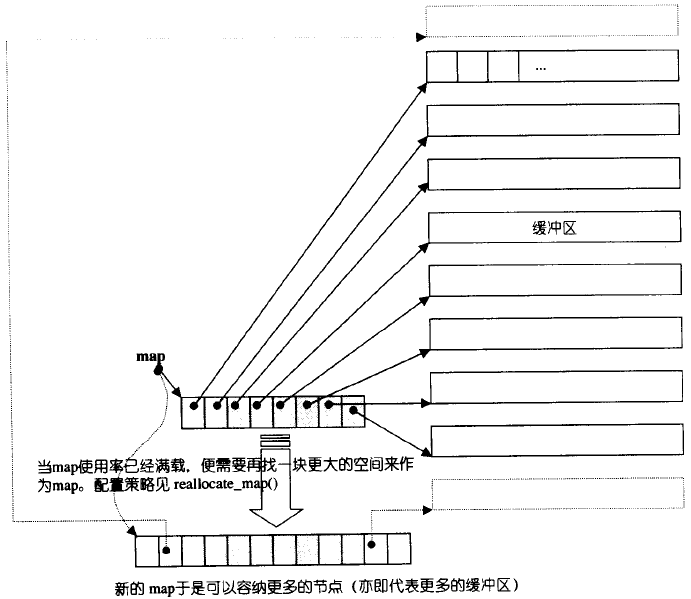

## 概述

容器（_containers_）、算法（_algorithms_）、迭代器（_iterators_）、仿函数（_functors_）、配接器（_adapters_）、配置器（_allocators_）


## 空间配置器

空间可以是内存、磁盘或其他辅助存储介质

### 空间配置器的标准接口

```c++
allocator::value_type
allocator::pointer
allocator::const_pointer
allocator::reference
allocator::const_reference
allocator::size_type
allocator::different_type
allocator::rebind//一个嵌套的class template
allocator::allocator()//default constructor
allocator::allocator(const allocator&)//copy constructor
template <class U>allocator::allocator(const allocator<U>&)//泛化的copy constuctor
allocator::~allocator()//default constructor
pointer allocator::address(reference x) const//返回某个对象地址
const pointer allocator::address(reference x) const //返回某个const对象地址
pointer allocator::allocate(size_type n, const void* = 0) //配置空间
void allocator::deallocate(pointer p, size_type n)//归还配置空间
size_type allocator::max_size() const//返回可配置最大空间
void allocator::constuct(pointer p, const T& x)
void allocator::destroy(pointer p)//等同于p->~T()
```

#### 设计一个简单的空间配置器

STL/Project1/...

```c++
size_t是unsigned类型，用于指明数组长度或下标，它必须是一个正数，std::size_t
ptrdiff_t是signed类型，用于存放同一数组中两个指针之间的差距，它可以使负数，std::ptrdiff_t.
size_type是unsigned类型,表示容器中元素长度或者下标，vector<int>::size_type i = 0;
difference_type是signed类型,表示迭代器差距，vector<int>:: difference_type = iter1-iter2.
//需要加上以下2个函数，windows的编译器用到了allocator不同类型的拷贝， 
allocator()
{
    return;
}
template <class U>
allocator(const allocator<U>& c){}
```

### 具备次配置力（sub-allocation）的SGI空间配置器

```c++
vector<int, std::allocator<int>> iv;//标准写法  in VC or CB
vector<int, std::alloc<int>> iv;//SGI配置器 in GCC
```

通常使用缺省的空间配置器，很少需要指定配置器名称

```c++
template <calss T, class Alloc = alloc>
class vector{ ... };
```

#### SGI标准的空间配置器，std::allocator

不建议用，效率不佳

#### SGI特殊空间配置器，std::alloc


#### 构造和析构基本工具：construct()和destroy()

```c++
#include <new.h>//placement new

template<class T1, class T2>
inline void _construct(T1* p, const T2& value)
{
    new(p) T1(value);//placement new,在已有空间基础上重新调整分配空间
                     //T1::T1(value)，减少空间分配所耗时间
}
```

##### 题外话:new、operator new、placement new

_new operator/delete operator_就是```new```和```delete```操作符，而_operator new/operator delete_是函数。

**_new operator_** 
（1）调用operator new分配足够的空间，并调用相关对象的构造函数
（2）不可以被重载

**_operator new_**
（1）只分配所要求的空间，不调用相关对象的构造函数。当无法满足所要求分配的空间时，则
    ->如果有```new_handler```，则调用```new_handler```，否则
    ->如果没要求不抛出异常（以```nothrow```参数表达），则执行```bad_alloc```异常，否则
    ->返回0
（2）可以被重载，重载时，返回类型必须声明为```void*```；第一个参数类型必须为表达要求分配空间的大小（字节），类型为```size_t```；可以带其它参数

**_placement new_** 

```placement new ```是重载```operator new``` 的一个标准、全局的版本，它不能够被自定义的版本代替。

```void *operator new( size_t, void * p ) throw() { return p; }```

_placement new_的执行忽略了```size_t```参数，只返还第二个参数。其结果是允许用户把一个对象放到一个特定的地方，达到调用构造函数的效果。和其他普通的new不同的是，它在括号里多了另外一个参数。比如：

```c++
Widget * p = new Widget;          //ordinary new
pi = new (ptr) int; pi = new (ptr) int;   //placement new
```

括号里的参数```ptr```是一个指针，它指向一个内存缓冲器，_placement new_将在这个缓冲器上分配一个对象。_Placement new_的返回值是这个被构造对象的地址(比如括号中的传递参数)。_placement new_主要适用于：在对时间要求非常高的应用程序中，因为这些程序分配的时间是确定的；长时间运行而不被打断的程序；以及执行一个垃圾收集器 (_garbage collector_)。

##### 回到正题

```c++
//edition1
template <class T>
inline void destroy(T* pointer){
    pointer->~T();
}
//edition2
template <class ForwardIterator>
inline void destroy(ForwardIterator first, ForwardIterator last){
    _destroy(first, last, value_type(first));
}
//判断value type是否有trivial destructor
template <class ForwardIterator, class T>
inline void _destroy(ForwardIterator first, ForwardIterator last, T*){
    typedef typename _type_traits<T>::has_trivial_destructor 
        trivial_destructor;
    _destroy_aux(first, last, trivial_destructor());
}
//value type有non-trivial destructor
template <class ForwardIterator>
inline void _destroy_aux(ForwardIterator first, ForwardIterator last, 
                         _false_type){
    for ( ; first < last; ++first)
        destroy(&*first);
}
//value type有trivial destructor
template <class ForwardIterator>
inline void _destroy_aux(ForwardIterator first, ForwardIterator last, 
                         _ture_type)
//针对char*和wchar_t*特化版
inline void destroy(char*, char*){}
inline void destroy(wchar_t*, wchar_t*){}
```


#### 空间的配置与释放，std::alloc

SGI的设计哲学：

- 向_system heap_要求空间
- 考虑多线程状态
- 考虑内存不足时的应变措施
- 考虑过多“小型区块”可能造成的内存碎片问题

基本操作：```malloc()```和```free()```，双层级配置器，超过128 bytes调用第一级，小于128 bytes，采用```memory pool```整理方式，第一级和第二级取决于```_USE_MALLOC```是否被定义，SGI STL并未定义


#### 第一级配置器__malloc_alloc_template剖析

第一级配置器以```malloc(),free(),realloc()```等C函数执行实际操作，不能直接运用C++ ```new-handler```机制

SGI第一级配置器的```mallocate()```和```realloc()```都是在调用```malloc()```和```realloc()```不成功后，改调用```oom_malloc()```和```oom_realloc()```，不断调用“内存不足处理例程”，但如果客端并未设定例程，则丢出异常信息或终止程序

#### 第二级配置器__default_alloc_template剖析

次层配置：没配置一块大内存，并维护对应的自由链表

```c++
union obj{
    union obj* free_list_link;
    char client_data[l];
}
```


#### 空间配置函数allocate()

判断区块大小，判断_free list_可用区块，调整区块大小边界```refill()```重新填充


#### 空间释放函数deallocate()


#### 重新填充free lists

_free list_中没有可用区块了就调用```refill()```，新的空间取自内存池(由```chunk_alloc()```完成)，缺省取得20个新节点

#### 内存池(memory pool)

假设程序一开始，客端调用```chunk_alloc(32,20)```，于是```malloc()```配置40个32 bytes区块，其中一个交出另外19个交给```free_list[3]```维护，余20留给内存池

接下来客端调用```chunk_alloc(64,20)```，此时```free_list[7]```为空，向内存池申请区块，内存池够供应十个区块，第一个交给客端，余9个由```free_list[7]```维护，内存池为空

接下来调用```chunk_alloc(96,20)```，```free_list[11]```为空，于是```malloc()```配置40+n(附加量)个96 bytes区块....


### 内存基本处理工具

STL定义五个全局函数：```construct(),destroy(),uninitialized_copy(),uninitialized_fill(),uninitialized_fill_n()```

#### uninitialized_copy

```c++
template <class InputIterator, class ForwardIterator>
ForwardIterator uninitialized_copy(InputIterator first, InputIterator last, 
                                   ForwardIterator result);
```

```construct(&* (result+(i-first)),* i) [first, last)```

将内存的配置和对象的构造行为分离

容器的全区间构造函数通常以两个步骤完成：

- 配置内存区块，足以包含范围内的所有元素
- 使用uninitialized_copy()，在该内存区块上构造元素

C++要求uninitialized_copy()具有"commit or rollback"，要么构造出所有必要元素，要么不构造任何东西


#### uninitialized_fill

```c++
template <class ForwardIterator, class T>
void uninitialized_fill(ForwardIteratorr first, ForwardIterator last, 
                        const T& x);
```

```construct(&* i, x) [first, last)```

也能使内存的配置和对象的构造行为分离

#### uninitialized_fill_n

```c++
template <class ForwardIterator, class Size, class T>
ForwardIterator uninitialized_fill_n(ForwardIteratorr first, Size n, 
                                     const T& x);
```

```construct(&* i, x) [first, first+n)```

 


## 迭代器(iterators)概念与traits编程技法

### 迭代器设计思维-STL关键所在

STL中心思想在于：将数据容器和算法公开，彼此独立设计，最后再以胶着剂把他们撮合在一起。class templates和function templates可分别达成目标，胶着剂才是难题

### 迭代器是一种smart pointer

迭代器最重要的编程工作就是对operator*和operator->进行重载工作

### 迭代器相应型别(associated types)

利用function template的参数推导机制

```c++
template <class I, class T>
void func_impl(I iter, T t)
{
    T tmp;
    ...
};

template <class I>
inline void fun(I iter)
{
    func_impl(iter,*iter);
}

int main()
{
    int i;
    func(&i);
}
```

以func()为对外接口，由func_impl是一个function template一旦被调用，编译器会自动进行参数推导

用于函数的传回值就束手无策

### Traits编程技法-STL源代码门钥

声明内嵌型别，还要特殊化处理

#### Partial Specialization的意义

如果class template拥有一个以上的template参数，我们可以针对其中某个template参数进行特化工作


#### value_type

迭代器所指对象型别，任何一个打算与STL算法有完美搭配的class都应该定义自己的value type内嵌型别

#### difference_type

表示两个迭代器之间的距离，可以表示容器最大容量，如果一个泛型算法提供计数功能，其传回值就必须使用difference type


#### reference type

从迭代器所指之物内容是否允许改变，迭代器分为两种：constant iterators，mutable iterators

#### pointer type

#### iterator_category

根据移动特性与实施操作，迭代器被分为五类：

- input iterator：所指对象不允许被外界改变。只读
- output iterator：只写
- forward iterator：允许“写入型”算法在这种迭代器所形成的区间上进行读写操作
- bidirectional iterator：可双向移动
- random access iterator：涵盖所有指针算术能力

消除“单纯传递调用的函数”


### std::iterator的保证

STL提供了iterators class基类


### SGI STL的私房菜：__type_traits

iterator_traits负责萃取迭代器的特性，__type_traits则负责萃取型别的特性

如果class内含指针成员，并且对它进行内存动态配置，那么这个class就需要实现出自己的non-trivial-xxx


## 序列式容器

### 容器的概观与分类


#### 序列式容器

元素可序ordered，但未必有序sorted


### vector

#### vector定义摘要

#### vector的迭代器

vector维护的是一个单向开口连续线性空间，普通指针都可以作为vector的迭代器而满足所有必要条件，提供的是random access iterator

#### vector的数据结构

线性连续空间，以两个迭代器start和finish分别指向配置得来的连续空间中已使用的范围，并以迭代器end_of_storage指向整块连续空间的尾端

#### vector的构造与内存管理：constructor，push_back

对vector的任何操作，一旦引起空间重新配置，指向原vector的所有迭代器就失效了

#### vector的元素操作：pop_back,erase,clear,insert

insert

备用空间大于新增元素个数：

插入点之后的现有元素个数大于新增元素个数

插入点之后的现有元素个数小于新增元素个数

备用空间小于新增元素个数


### list

#### list概述

#### list的节点(node)

#### list的迭代器

STL list是一个双向链表，迭代器必须具备前移和后移=能力，所以list提供bidirectional iterators

insert和splice都不会造成原有list迭代器失效

#### list的数据结构

SGI list环形双向链表

#### list的构造与内存管理：constructor，push_back，insert

#### list的元素操作：push_front,push_back,erase,pop_front,pop_back,clear,remove,unique, splice,merge,reverse,sort


### deque

#### deque概述

双向开口的连续空间

deque允许于常数时间内对头端进行元素的插入和移除操作

deque没有所谓容量观念，因为它是动态地以分段连续空间组合而成，随时可以增加一段新的空间并链接

deque提供random access iterator，但迭代器不是普通指针

#### deque的中控器

deque采用一块所谓的map作为主控，map是一小块连续空间，其中每个元素都是指针，指向另一段（较大的）连续线性空间，称为缓存区



#### deque的迭代器


#### deque的数据结构

#### deque的构造与内存管理：constructor，push_back，push_front

#### deque的元素操作：erase,pop_front,pop_back,clear,insert


### stack

#### stack概述

先进后出（FILO）的数据结构，允许新增、移除、取得最顶端元素，不允许有遍历行为

#### stack定义完整列表

SGI STL以deque作为缺省情况下的stack底部结构

“修改某物接口，形成另一种风貌”的性质的称为adapter

#### stack没有迭代器

#### 以list作为stack的底部容器


### queue

#### queue概述

先进先出（FIFO）的数据结构，允许新增、移除、从最底端加入元素，取得最顶端元素，不允许有遍历行为

#### queue定义完整列表

SGI STL以deque作为缺省情况下的queue底部结构

#### queue没有迭代器

#### 以list作为queue的底部容器


### heap

#### heap概述

priority queue的底层机制

binary heap就是一种complete binary tree